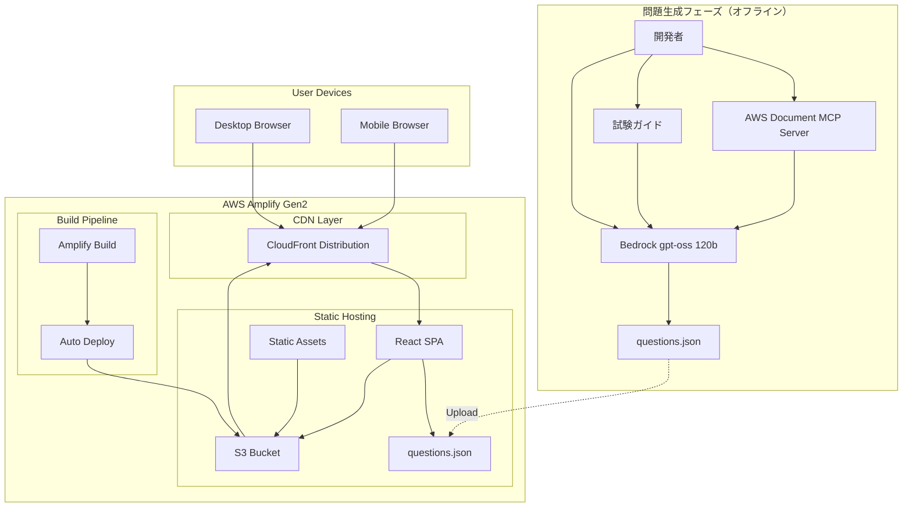
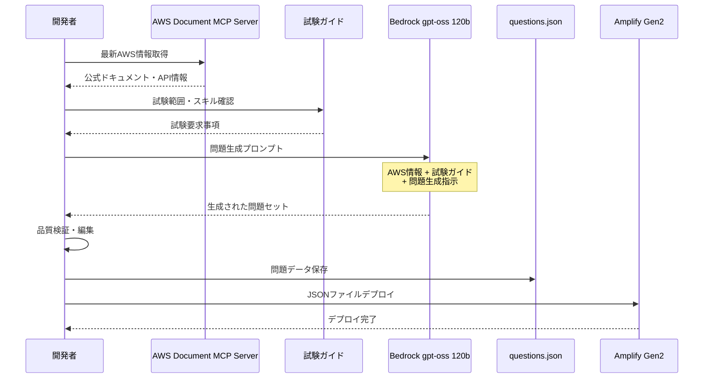
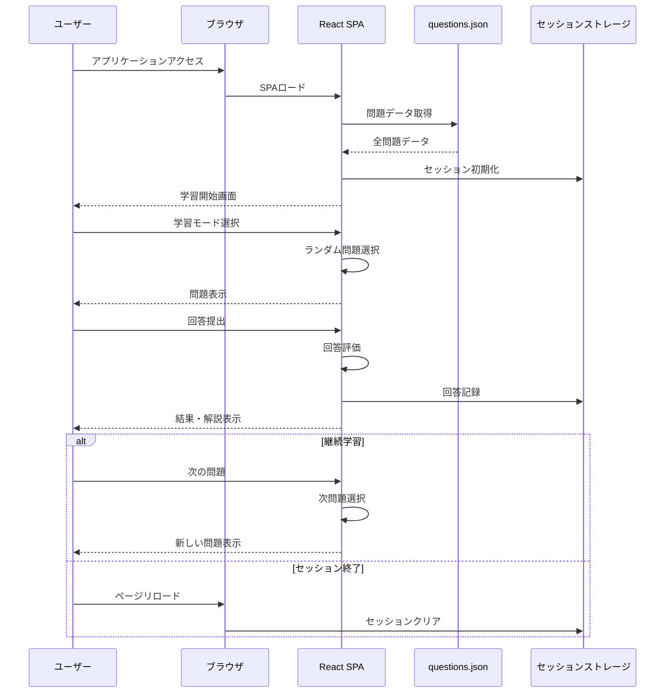

# 設計文書

## 概要

AWS Certified CloudOps Engineer - Associate試験対策アプリケーションは、事前生成された高品質な問題を使用してJSONファイルから提供するシンプルなSPA（Single Page Application）です。本システムは、AWS Document MCPサーバーとgpt-oss 120bモデルを活用して事前に生成された問題を、AWS Amplify Gen2でホスティングされるReactアプリケーションで提供します。

システムの核となる設計原則：
- **シンプルなSPAアーキテクチャ**: バックエンドサーバー不要の静的Webアプリケーション
- **事前問題生成**: オフラインで生成されたJSONファイルベースの問題提供
- **セッションベース**: ブラウザリロード時に初期化される学習データ管理
- **モバイルファースト**: デスクトップとスマートフォンの両方に最適化
- **最新情報の活用**: AWS Document MCPサーバーと試験ガイドによる正確なコンテンツ生成

## アーキテクチャ

### システム全体アーキテクチャ



### 事前問題生成フロー



### ユーザー学習フロー



## コンポーネントと インターフェース

### 問題生成プロセス（オフライン）

#### 問題生成スクリプト

```python
# 問題生成用のPythonスクリプト
import boto3
import json
from typing import List, Dict

class QuestionGenerator:
    def __init__(self):
        self.bedrock = boto3.client('bedrock-runtime')
        self.model_id = 'openai.gpt-oss-120b-1:0'
    
    def generate_questions(self, domain: str, count: int) -> List[Dict]:
        """
        指定ドメインの問題を生成
        
        Args:
            domain: 試験ドメイン
            count: 生成する問題数
        
        Returns:
            問題データのリスト
        """
        prompt = self._build_prompt(domain)
        response = self._call_bedrock(prompt)
        return self._parse_response(response)
    
    def _build_prompt(self, domain: str) -> str:
        """AWS Document MCP情報と試験ガイドを含むプロンプト構築"""
        return f"""
        AWS Certified CloudOps Engineer - Associate試験の{domain}ドメインから、
        実践的な4択問題を生成してください。
        
        参考情報：
        - AWS公式ドキュメント（最新版）
        - 試験ガイドの要求スキル
        - 実務シナリオ
        
        出力形式：JSON
        """
```

#### 問題データ検証

```python
class QuestionValidator:
    def validate_question(self, question: Dict) -> bool:
        """問題データの品質検証"""
        required_fields = ['id', 'question', 'options', 'correct_answer', 'explanation']
        
        # 必須フィールドチェック
        if not all(field in question for field in required_fields):
            return False
        
        # 選択肢数チェック
        if len(question['options']) != 4:
            return False
        
        # 正解の妥当性チェック
        if question['correct_answer'] not in ['A', 'B', 'C', 'D']:
            return False
        
        return True
```

### JSONデータ構造

#### 問題データ形式

```typescript
interface Question {
  id: string;
  domain: string;
  difficulty: 'easy' | 'medium' | 'hard';
  type: 'single' | 'multiple';
  question: string;
  options: string[];
  correctAnswer: string | string[];
  explanation: string;
  learningResources: LearningResource[];
  relatedServices: string[];
  tags: string[];
}

interface LearningResource {
  title: string;
  url: string;
  type: 'documentation' | 'blog' | 'video' | 'whitepaper';
  description?: string;
}

interface QuestionSet {
  version: string;
  generatedAt: string;
  totalQuestions: number;
  domains: {
    [domain: string]: number;
  };
  questions: Question[];
}
```

#### サンプルJSONファイル

```json
{
  "version": "1.0.0",
  "generatedAt": "2025-01-15T10:00:00Z",
  "totalQuestions": 500,
  "domains": {
    "monitoring": 100,
    "reliability": 160,
    "deployment": 100,
    "security": 80,
    "networking": 60
  },
  "questions": [
    {
      "id": "q001",
      "domain": "monitoring",
      "difficulty": "medium",
      "type": "single",
      "question": "あなたの会社では、EC2インスタンスのCPU使用率が80%を超えた場合にアラートを受信したいと考えています。この要件を満たすために最も適切なAWSサービスはどれですか？",
      "options": [
        "A. Amazon CloudWatch",
        "B. AWS CloudTrail",
        "C. AWS Config",
        "D. Amazon Inspector"
      ],
      "correctAnswer": "A",
      "explanation": "Amazon CloudWatchは、AWSリソースのメトリクスを監視し、指定した閾値を超えた場合にアラームを発生させることができます。CPU使用率などのEC2メトリクスを監視し、80%を超えた場合にSNS通知やAutoScalingアクションをトリガーできます。",
      "learningResources": [
        {
          "title": "Amazon CloudWatch User Guide",
          "url": "https://docs.aws.amazon.com/cloudwatch/",
          "type": "documentation"
        }
      ],
      "relatedServices": ["EC2", "SNS", "Auto Scaling"],
      "tags": ["monitoring", "alarms", "cpu"]
    }
  ]
}
```

### React SPAコンポーネント

#### App Component（メインアプリケーション）

```typescript
interface AppState {
  questions: Question[];
  currentMode: 'menu' | 'quiz' | 'result';
  quizConfig: QuizConfig;
  isLoading: boolean;
}

interface QuizConfig {
  mode: 'set' | 'endless';
  domain?: string;
  questionCount: number;
}

const App: React.FC = () => {
  const [questions, setQuestions] = useState<Question[]>([]);
  const [currentMode, setCurrentMode] = useState<'menu' | 'quiz' | 'result'>('menu');
  
  useEffect(() => {
    // questions.jsonを読み込み
    fetch('/questions.json')
      .then(response => response.json())
      .then(data => setQuestions(data.questions));
  }, []);
  
  return (
    <div className="app">
      {currentMode === 'menu' && <MenuScreen onStart={startQuiz} />}
      {currentMode === 'quiz' && <QuizScreen questions={questions} config={quizConfig} />}
      {currentMode === 'result' && <ResultScreen />}
    </div>
  );
};
```

#### QuizScreen Component

```typescript
interface QuizScreenProps {
  questions: Question[];
  config: QuizConfig;
}

interface QuizState {
  currentQuestionIndex: number;
  selectedAnswer: string | string[];
  showResult: boolean;
  answers: Answer[];
  startTime: Date;
}

const QuizScreen: React.FC<QuizScreenProps> = ({ questions, config }) => {
  const [currentQuestionIndex, setCurrentQuestionIndex] = useState(0);
  const [selectedAnswer, setSelectedAnswer] = useState<string>('');
  const [showResult, setShowResult] = useState(false);
  const [answers, setAnswers] = useState<Answer[]>([]);
  
  const currentQuestion = questions[currentQuestionIndex];
  
  const handleSubmitAnswer = () => {
    const isCorrect = selectedAnswer === currentQuestion.correctAnswer;
    const newAnswer: Answer = {
      questionId: currentQuestion.id,
      userAnswer: selectedAnswer,
      correctAnswer: currentQuestion.correctAnswer,
      isCorrect,
      answeredAt: new Date()
    };
    
    setAnswers([...answers, newAnswer]);
    setShowResult(true);
  };
  
  return (
    <div className="quiz-screen">
      <QuestionDisplay 
        question={currentQuestion}
        selectedAnswer={selectedAnswer}
        onAnswerSelect={setSelectedAnswer}
        onSubmit={handleSubmitAnswer}
        showResult={showResult}
      />
      {showResult && (
        <ResultDisplay 
          answer={answers[answers.length - 1]}
          question={currentQuestion}
          onNext={handleNextQuestion}
        />
      )}
    </div>
  );
};
```

#### QuestionDisplay Component

```typescript
interface QuestionDisplayProps {
  question: Question;
  selectedAnswer: string;
  onAnswerSelect: (answer: string) => void;
  onSubmit: () => void;
  showResult: boolean;
}

const QuestionDisplay: React.FC<QuestionDisplayProps> = ({
  question,
  selectedAnswer,
  onAnswerSelect,
  onSubmit,
  showResult
}) => {
  return (
    <div className="question-display">
      <div className="question-header">
        <span className="domain-badge">{question.domain}</span>
        <span className="difficulty-badge">{question.difficulty}</span>
      </div>
      
      <h2 className="question-text">{question.question}</h2>
      
      <div className="options">
        {question.options.map((option, index) => (
          <label key={index} className="option">
            <input
              type="radio"
              name="answer"
              value={option.charAt(0)}
              checked={selectedAnswer === option.charAt(0)}
              onChange={(e) => onAnswerSelect(e.target.value)}
              disabled={showResult}
            />
            <span className="option-text">{option}</span>
          </label>
        ))}
      </div>
      
      {!showResult && (
        <button 
          className="submit-button"
          onClick={onSubmit}
          disabled={!selectedAnswer}
        >
          回答する
        </button>
      )}
    </div>
  );
};
```

#### ResultDisplay Component

```typescript
interface ResultDisplayProps {
  answer: Answer;
  question: Question;
  onNext: () => void;
}

const ResultDisplay: React.FC<ResultDisplayProps> = ({ answer, question, onNext }) => {
  return (
    <div className="result-display">
      <div className={`result-header ${answer.isCorrect ? 'correct' : 'incorrect'}`}>
        <h3>{answer.isCorrect ? '正解！' : '不正解'}</h3>
        <p>正解: {question.correctAnswer}</p>
      </div>
      
      <div className="explanation">
        <h4>解説</h4>
        <p>{question.explanation}</p>
      </div>
      
      {question.learningResources.length > 0 && (
        <div className="learning-resources">
          <h4>学習リソース</h4>
          <ul>
            {question.learningResources.map((resource, index) => (
              <li key={index}>
                <a href={resource.url} target="_blank" rel="noopener noreferrer">
                  {resource.title}
                </a>
                <span className="resource-type">({resource.type})</span>
              </li>
            ))}
          </ul>
        </div>
      )}
      
      <button className="next-button" onClick={onNext}>
        次の問題
      </button>
    </div>
  );
};
```

## データモデル

### セッションストレージ管理

#### セッションデータ構造

```typescript
interface SessionData {
  sessionId: string;
  startedAt: Date;
  mode: 'set' | 'endless';
  targetQuestionCount?: number;
  currentQuestionIndex: number;
  answers: Answer[];
  usedQuestionIds: string[];
  domainFilter?: string;
}

interface Answer {
  questionId: string;
  userAnswer: string | string[];
  correctAnswer: string | string[];
  isCorrect: boolean;
  answeredAt: Date;
  timeSpent?: number;
}

interface QuizStatistics {
  totalQuestions: number;
  correctAnswers: number;
  accuracy: number;
  domainBreakdown: {
    [domain: string]: {
      total: number;
      correct: number;
      accuracy: number;
    };
  };
  averageTimePerQuestion?: number;
}
```

#### セッション管理クラス

```typescript
class SessionManager {
  private static readonly SESSION_KEY = 'cloudops_quiz_session';
  
  static createSession(mode: 'set' | 'endless', targetCount?: number): SessionData {
    const session: SessionData = {
      sessionId: this.generateSessionId(),
      startedAt: new Date(),
      mode,
      targetQuestionCount: targetCount,
      currentQuestionIndex: 0,
      answers: [],
      usedQuestionIds: []
    };
    
    sessionStorage.setItem(this.SESSION_KEY, JSON.stringify(session));
    return session;
  }
  
  static getSession(): SessionData | null {
    const data = sessionStorage.getItem(this.SESSION_KEY);
    return data ? JSON.parse(data) : null;
  }
  
  static updateSession(session: SessionData): void {
    sessionStorage.setItem(this.SESSION_KEY, JSON.stringify(session));
  }
  
  static clearSession(): void {
    sessionStorage.removeItem(this.SESSION_KEY);
  }
  
  static calculateStatistics(session: SessionData): QuizStatistics {
    const { answers } = session;
    const correctAnswers = answers.filter(a => a.isCorrect).length;
    
    const domainBreakdown: { [domain: string]: { total: number; correct: number; accuracy: number } } = {};
    
    // ドメイン別統計計算
    answers.forEach(answer => {
      // 問題データから domain を取得する必要がある
      // 実装時に questions データと照合
    });
    
    return {
      totalQuestions: answers.length,
      correctAnswers,
      accuracy: answers.length > 0 ? (correctAnswers / answers.length) * 100 : 0,
      domainBreakdown
    };
  }
  
  private static generateSessionId(): string {
    return `session_${Date.now()}_${Math.random().toString(36).substr(2, 9)}`;
  }
}
```

### 問題選択ロジック

```typescript
class QuestionSelector {
  static selectRandomQuestion(
    questions: Question[], 
    usedQuestionIds: string[], 
    domainFilter?: string
  ): Question | null {
    // フィルタリング
    let availableQuestions = questions.filter(q => 
      !usedQuestionIds.includes(q.id) &&
      (!domainFilter || q.domain === domainFilter)
    );
    
    if (availableQuestions.length === 0) {
      // 全問題を使い切った場合は使用済みをリセット
      availableQuestions = questions.filter(q => 
        !domainFilter || q.domain === domainFilter
      );
    }
    
    if (availableQuestions.length === 0) {
      return null;
    }
    
    // ランダム選択
    const randomIndex = Math.floor(Math.random() * availableQuestions.length);
    return availableQuestions[randomIndex];
  }
  
  static selectQuestionSet(
    questions: Question[], 
    count: number, 
    domainFilter?: string
  ): Question[] {
    const selectedQuestions: Question[] = [];
    const usedIds: string[] = [];
    
    for (let i = 0; i < count; i++) {
      const question = this.selectRandomQuestion(questions, usedIds, domainFilter);
      if (question) {
        selectedQuestions.push(question);
        usedIds.push(question.id);
      }
    }
    
    return selectedQuestions;
  }
}

## エラーハンドリング

### フロントエンドエラーハンドリング

```typescript
// エラータイプ定義
enum ErrorTypes {
  NETWORK_ERROR = 'NETWORK_ERROR',
  DATA_LOAD_ERROR = 'DATA_LOAD_ERROR',
  SESSION_ERROR = 'SESSION_ERROR',
  VALIDATION_ERROR = 'VALIDATION_ERROR'
}

interface AppError {
  type: ErrorTypes;
  message: string;
  details?: any;
  timestamp: Date;
}

class ErrorHandler {
  static handleError(error: AppError): void {
    console.error('Application Error:', error);
    
    // ユーザーフレンドリーなメッセージを表示
    const userMessage = this.getUserMessage(error);
    this.showErrorToUser(userMessage);
  }
  
  static getUserMessage(error: AppError): string {
    switch (error.type) {
      case ErrorTypes.NETWORK_ERROR:
        return 'ネットワーク接続に問題があります。インターネット接続を確認してください。';
      case ErrorTypes.DATA_LOAD_ERROR:
        return '問題データの読み込みに失敗しました。ページを再読み込みしてください。';
      case ErrorTypes.SESSION_ERROR:
        return 'セッションに問題が発生しました。新しいセッションを開始してください。';
      case ErrorTypes.VALIDATION_ERROR:
        return '入力データに問題があります。もう一度お試しください。';
      default:
        return '予期しないエラーが発生しました。ページを再読み込みしてください。';
    }
  }
  
  static showErrorToUser(message: string): void {
    // Toast通知やモーダルでエラーメッセージを表示
    // 実装時にUI ライブラリに応じて実装
  }
}

// データ読み込みエラーハンドリング
class DataLoader {
  static async loadQuestions(): Promise<Question[]> {
    try {
      const response = await fetch('/questions.json');
      
      if (!response.ok) {
        throw new Error(`HTTP ${response.status}: ${response.statusText}`);
      }
      
      const data = await response.json();
      
      if (!this.validateQuestionData(data)) {
        throw new Error('Invalid question data format');
      }
      
      return data.questions;
    } catch (error) {
      const appError: AppError = {
        type: ErrorTypes.DATA_LOAD_ERROR,
        message: 'Failed to load questions',
        details: error,
        timestamp: new Date()
      };
      
      ErrorHandler.handleError(appError);
      return [];
    }
  }
  
  static validateQuestionData(data: any): boolean {
    return (
      data &&
      typeof data === 'object' &&
      Array.isArray(data.questions) &&
      data.questions.length > 0 &&
      data.questions.every((q: any) => 
        q.id && q.question && Array.isArray(q.options) && q.correctAnswer
      )
    );
  }
}
```

### セッション復旧機能

```typescript
class SessionRecovery {
  static attemptRecovery(): SessionData | null {
    try {
      const session = SessionManager.getSession();
      
      if (!session) {
        return null;
      }
      
      // セッションデータの整合性チェック
      if (this.validateSession(session)) {
        return session;
      } else {
        // 破損したセッションをクリア
        SessionManager.clearSession();
        return null;
      }
    } catch (error) {
      console.warn('Session recovery failed:', error);
      SessionManager.clearSession();
      return null;
    }
  }
  
  static validateSession(session: SessionData): boolean {
    return (
      session.sessionId &&
      session.startedAt &&
      session.mode &&
      Array.isArray(session.answers) &&
      Array.isArray(session.usedQuestionIds)
    );
  }
}

### React Error Boundary

```typescript
interface ErrorBoundaryState {
  hasError: boolean;
  error?: Error;
  errorInfo?: ErrorInfo;
}

class ErrorBoundary extends React.Component<
  React.PropsWithChildren<{}>,
  ErrorBoundaryState
> {
  constructor(props: React.PropsWithChildren<{}>) {
    super(props);
    this.state = { hasError: false };
  }
  
  static getDerivedStateFromError(error: Error): ErrorBoundaryState {
    return { hasError: true, error };
  }
  
  componentDidCatch(error: Error, errorInfo: ErrorInfo) {
    console.error('React Error Boundary caught an error:', error, errorInfo);
    
    const appError: AppError = {
      type: ErrorTypes.VALIDATION_ERROR,
      message: 'React component error',
      details: { error, errorInfo },
      timestamp: new Date()
    };
    
    ErrorHandler.handleError(appError);
  }
  
  render() {
    if (this.state.hasError) {
      return (
        <div className="error-fallback">
          <h2>申し訳ございません</h2>
          <p>アプリケーションでエラーが発生しました。</p>
          <button 
            onClick={() => window.location.reload()}
            className="reload-button"
          >
            ページを再読み込み
          </button>
        </div>
      );
    }
    
    return this.props.children;
  }
}

## テスト戦略

### 問題生成スクリプトテスト

#### 単体テスト

```python
import unittest
from unittest.mock import Mock, patch
from question_generator import QuestionGenerator, QuestionValidator

class TestQuestionGenerator(unittest.TestCase):
    def setUp(self):
        self.generator = QuestionGenerator()
        self.validator = QuestionValidator()
    
    @patch('boto3.client')
    def test_generate_questions(self, mock_bedrock):
        """問題生成機能のテスト"""
        # モックレスポンス
        mock_response = {
            'body': {
                'read': lambda: json.dumps({
                    'id': 'q001',
                    'question': 'Test question?',
                    'options': ['A. Option 1', 'B. Option 2', 'C. Option 3', 'D. Option 4'],
                    'correct_answer': 'A',
                    'explanation': 'Test explanation'
                }).encode()
            }
        }
        mock_bedrock.return_value.invoke_model.return_value = mock_response
        
        # テスト実行
        questions = self.generator.generate_questions('monitoring', 1)
        
        # 検証
        self.assertEqual(len(questions), 1)
        self.assertIn('question', questions[0])
        self.assertEqual(len(questions[0]['options']), 4)
    
    def test_question_validation(self):
        """問題データ検証のテスト"""
        valid_question = {
            'id': 'q001',
            'question': 'Test question?',
            'options': ['A. Option 1', 'B. Option 2', 'C. Option 3', 'D. Option 4'],
            'correct_answer': 'A',
            'explanation': 'Test explanation'
        }
        
        invalid_question = {
            'id': 'q002',
            'question': 'Test question?',
            'options': ['A. Option 1', 'B. Option 2'],  # 選択肢が不足
            'correct_answer': 'A'
        }
        
        self.assertTrue(self.validator.validate_question(valid_question))
        self.assertFalse(self.validator.validate_question(invalid_question))
```

### フロントエンドテスト

#### コンポーネントテスト

```typescript
import { render, screen, fireEvent, waitFor } from '@testing-library/react';
import { QuestionDisplay } from '../components/QuestionDisplay';

describe('QuestionDisplay', () => {
  const mockQuestion: Question = {
    id: 'q001',
    domain: 'monitoring',
    difficulty: 'medium',
    type: 'single',
    question: 'Which service monitors AWS resources?',
    options: ['A. CloudWatch', 'B. CloudTrail', 'C. Config', 'D. Inspector'],
    correctAnswer: 'A',
    explanation: 'CloudWatch monitors AWS resources.',
    learningResources: [],
    relatedServices: ['CloudWatch'],
    tags: ['monitoring']
  };
  
  test('should display question and options', () => {
    render(
      <QuestionDisplay
        question={mockQuestion}
        selectedAnswer=""
        onAnswerSelect={jest.fn()}
        onSubmit={jest.fn()}
        showResult={false}
      />
    );
    
    expect(screen.getByText(mockQuestion.question)).toBeInTheDocument();
    mockQuestion.options.forEach(option => {
      expect(screen.getByText(option)).toBeInTheDocument();
    });
  });
  
  test('should handle answer selection', () => {
    const mockOnAnswerSelect = jest.fn();
    
    render(
      <QuestionDisplay
        question={mockQuestion}
        selectedAnswer=""
        onAnswerSelect={mockOnAnswerSelect}
        onSubmit={jest.fn()}
        showResult={false}
      />
    );
    
    const optionA = screen.getByLabelText(/A\. CloudWatch/);
    fireEvent.click(optionA);
    
    expect(mockOnAnswerSelect).toHaveBeenCalledWith('A');
  });
  
  test('should disable options when result is shown', () => {
    render(
      <QuestionDisplay
        question={mockQuestion}
        selectedAnswer="A"
        onAnswerSelect={jest.fn()}
        onSubmit={jest.fn()}
        showResult={true}
      />
    );
    
    const radioButtons = screen.getAllByRole('radio');
    radioButtons.forEach(button => {
      expect(button).toBeDisabled();
    });
  });
});
```

#### セッション管理テスト

```typescript
import { SessionManager } from '../utils/SessionManager';

describe('SessionManager', () => {
  beforeEach(() => {
    sessionStorage.clear();
  });
  
  test('should create new session', () => {
    const session = SessionManager.createSession('set', 10);
    
    expect(session.sessionId).toBeDefined();
    expect(session.mode).toBe('set');
    expect(session.targetQuestionCount).toBe(10);
    expect(session.answers).toEqual([]);
    expect(session.usedQuestionIds).toEqual([]);
  });
  
  test('should retrieve existing session', () => {
    const originalSession = SessionManager.createSession('endless');
    const retrievedSession = SessionManager.getSession();
    
    expect(retrievedSession).toEqual(originalSession);
  });
  
  test('should clear session', () => {
    SessionManager.createSession('set', 5);
    SessionManager.clearSession();
    
    const session = SessionManager.getSession();
    expect(session).toBeNull();
  });
  
  test('should calculate statistics correctly', () => {
    const session = SessionManager.createSession('set', 3);
    session.answers = [
      { questionId: 'q1', userAnswer: 'A', correctAnswer: 'A', isCorrect: true, answeredAt: new Date() },
      { questionId: 'q2', userAnswer: 'B', correctAnswer: 'A', isCorrect: false, answeredAt: new Date() },
      { questionId: 'q3', userAnswer: 'C', correctAnswer: 'C', isCorrect: true, answeredAt: new Date() }
    ];
    
    const stats = SessionManager.calculateStatistics(session);
    
    expect(stats.totalQuestions).toBe(3);
    expect(stats.correctAnswers).toBe(2);
    expect(stats.accuracy).toBeCloseTo(66.67, 2);
  });
});
```

### フロントエンドテスト

```typescript
describe('QuizInterface', () => {
  test('should display question and options', () => {
    const mockQuestion = {
      questionId: '123',
      question: 'Which service monitors AWS resources?',
      options: ['A. CloudWatch', 'B. CloudTrail', 'C. Config', 'D. Inspector'],
      type: 'single'
    };
    
    render(<QuizInterface />);
    
    expect(screen.getByText(mockQuestion.question)).toBeInTheDocument();
    mockQuestion.options.forEach(option => {
      expect(screen.getByText(option)).toBeInTheDocument();
    });
  });
});
```

### データ読み込みテスト

```typescript
import { DataLoader } from '../utils/DataLoader';

describe('DataLoader', () => {
  beforeEach(() => {
    global.fetch = jest.fn();
  });
  
  afterEach(() => {
    jest.resetAllMocks();
  });
  
  test('should load questions successfully', async () => {
    const mockQuestionData = {
      version: '1.0.0',
      questions: [
        {
          id: 'q001',
          question: 'Test question?',
          options: ['A. Option 1', 'B. Option 2', 'C. Option 3', 'D. Option 4'],
          correctAnswer: 'A',
          explanation: 'Test explanation'
        }
      ]
    };
    
    (global.fetch as jest.Mock).mockResolvedValueOnce({
      ok: true,
      json: async () => mockQuestionData
    });
    
    const questions = await DataLoader.loadQuestions();
    
    expect(questions).toEqual(mockQuestionData.questions);
    expect(global.fetch).toHaveBeenCalledWith('/questions.json');
  });
  
  test('should handle network errors', async () => {
    (global.fetch as jest.Mock).mockRejectedValueOnce(new Error('Network error'));
    
    const questions = await DataLoader.loadQuestions();
    
    expect(questions).toEqual([]);
  });
  
  test('should handle invalid data format', async () => {
    const invalidData = { invalid: 'data' };
    
    (global.fetch as jest.Mock).mockResolvedValueOnce({
      ok: true,
      json: async () => invalidData
    });
    
    const questions = await DataLoader.loadQuestions();
    
    expect(questions).toEqual([]);
  });
});
```

### パフォーマンステスト

```typescript
describe('Performance Tests', () => {
  test('should load questions within acceptable time', async () => {
    const startTime = performance.now();
    
    // 大量の問題データをモック
    const largeQuestionSet = {
      questions: Array.from({ length: 1000 }, (_, i) => ({
        id: `q${i}`,
        question: `Question ${i}?`,
        options: ['A. Option 1', 'B. Option 2', 'C. Option 3', 'D. Option 4'],
        correctAnswer: 'A',
        explanation: `Explanation ${i}`
      }))
    };
    
    global.fetch = jest.fn().mockResolvedValueOnce({
      ok: true,
      json: async () => largeQuestionSet
    });
    
    const questions = await DataLoader.loadQuestions();
    
    const endTime = performance.now();
    const loadTime = endTime - startTime;
    
    expect(questions).toHaveLength(1000);
    expect(loadTime).toBeLessThan(1000); // 1秒以内
  });
  
  test('should handle question selection efficiently', () => {
    const questions = Array.from({ length: 500 }, (_, i) => ({
      id: `q${i}`,
      domain: i % 5 === 0 ? 'monitoring' : 'deployment',
      question: `Question ${i}?`,
      options: ['A. Option 1', 'B. Option 2', 'C. Option 3', 'D. Option 4'],
      correctAnswer: 'A',
      explanation: `Explanation ${i}`
    }));
    
    const startTime = performance.now();
    
    const selectedQuestion = QuestionSelector.selectRandomQuestion(
      questions, 
      [], 
      'monitoring'
    );
    
    const endTime = performance.now();
    const selectionTime = endTime - startTime;
    
    expect(selectedQuestion).toBeDefined();
    expect(selectedQuestion?.domain).toBe('monitoring');
    expect(selectionTime).toBeLessThan(10); // 10ms以内
  });
});
```

### E2Eテスト

```typescript
// Cypress E2Eテスト例
describe('Quiz Application E2E', () => {
  beforeEach(() => {
    cy.visit('/');
  });
  
  it('should complete a full quiz session', () => {
    // メニュー画面から10問セットを開始
    cy.contains('10問セット').click();
    cy.contains('開始').click();
    
    // 10問回答
    for (let i = 0; i < 10; i++) {
      // 問題が表示されることを確認
      cy.get('.question-text').should('be.visible');
      
      // 最初の選択肢を選択
      cy.get('input[type="radio"]').first().click();
      
      // 回答ボタンをクリック
      cy.contains('回答する').click();
      
      // 結果が表示されることを確認
      cy.get('.result-display').should('be.visible');
      
      // 最後の問題でなければ次へ
      if (i < 9) {
        cy.contains('次の問題').click();
      }
    }
    
    // 最終結果画面の確認
    cy.contains('結果を見る').click();
    cy.get('.final-score').should('be.visible');
    cy.get('.accuracy').should('contain', '%');
  });
  
  it('should work on mobile devices', () => {
    cy.viewport('iphone-x');
    
    // モバイル表示の確認
    cy.get('.app').should('have.class', 'mobile-optimized');
    
    // タッチ操作のテスト
    cy.contains('10問セット').click();
    cy.contains('開始').click();
    
    // モバイルでの問題表示確認
    cy.get('.question-display').should('be.visible');
    cy.get('.options').should('have.class', 'mobile-layout');
  });
});
```

この設計により、シンプルで効率的なAWS CloudOps試験対策SPAを構築できます。事前生成されたJSONファイルによる高品質な問題提供、AWS Amplify Gen2による簡単なデプロイメント、セッションベースの学習管理、モバイル最適化により、ユーザーフレンドリーな学習環境を提供します。