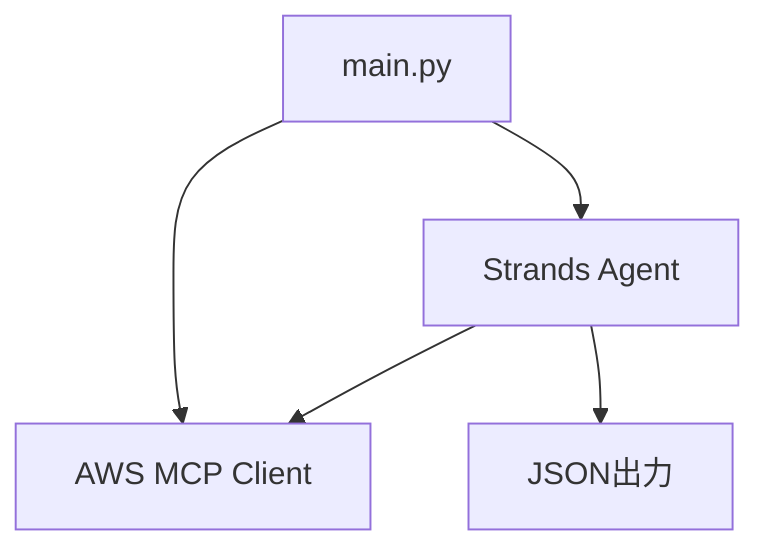

# 設計書

## 概要

AWS CloudOps試験問題生成ツールは、AWS Document MCPサーバーとStrands Agentsを活用して、一度に10問の高品質な試験問題を生成する超シンプルなPythonコマンドラインツールです。複雑なロジックは一切排除し、生成AIに全てを任せることで、約100行程度の最小限のコードで実現します。

## アーキテクチャ

### システム構成図



### 超シンプル設計原則

1. **単一ファイル**: main.py一つで完結
2. **設定なし**: ハードコードされた設定のみ
3. **検証なし**: 生成AIが全て適切に処理
4. **エラーハンドリング最小限**: 基本的なMCP接続エラーのみ

## コンポーネント設計

### 単一ファイル構造 (main.py)

**全体で約100行の超シンプル実装**

```python
# 必要な要素のみ
1. Pydanticモデル定義 (Question, Choice) - 約20行
2. MCP接続とAgent初期化 - 約10行  
3. 問題生成プロンプト - 約10行
4. 構造化出力での10問生成 - 約20行
5. JSON保存 - 約10行
6. メイン実行部分 - 約10行
7. エラーハンドリング - 約20行
```

### 設計判断

**生成AIに任せる部分**:
- ドメイン配分の決定
- 難易度レベルの調整
- AWS文書の検索と選択
- 問題文の作成
- 選択肢の生成
- 解説の作成
- 学習リソースの選定

**コードで制御する部分**:
- MCP接続の確立
- Pydanticモデルでの型定義
- JSON出力のファイル保存
- 基本的なエラーハンドリング

**削除する複雑な機能**:
- 設定ファイル読み込み
- 複雑な検証ロジック
- ドメイン配分計算
- カスタムファイル管理
- 詳細なログ機能

## データモデル

### 最小限のPydanticモデル

```python
from pydantic import BaseModel
from typing import List

class Choice(BaseModel):
    id: str
    text: str
    is_correct: bool

class Question(BaseModel):
    id: str  # 形式: "q{YYYYMMDD}_{HHMMSS}_{001-010}"
    question_text: str
    choices: List[Choice]
    question_type: str  # "single_choice" or "multiple_choice"
    correct_answers: List[str]
    explanation: str
    learning_resources: List[str]
    domain: str  # 5つのドメインのいずれか
    difficulty: str  # "easy", "medium", "hard"
    aws_services: List[str]

class QuestionSet(BaseModel):
    questions: List[Question]
    generation_timestamp: str
    total_questions: int = 10
    domains: dict  # ドメイン配分情報
    difficulty_distribution: dict  # 難易度配分情報
```

**設計判断**: 
- Enumは削除してシンプルなstr型を使用
- 要件15に従いタイムスタンプベースの一意ID生成を実装
- 要件17に従いメタデータ（total_questions、domains、difficulty_distribution）を含む
- 要件4に従いquestion_typeフィールドを追加
- 生成AIが適切な値を設定することを信頼

## エラーハンドリング

### 最小限のエラー処理

```python
try:
    # MCP接続とAgent実行
    with mcp_client:
        # 問題生成
        pass
except Exception as e:
    print(f"エラーが発生しました: {e}")
    print("uvがインストールされているか確認してください")
    sys.exit(1)
```

**設計判断**: 
- 複雑なエラー分類は削除
- 基本的なtry-except文のみ
- ユーザーフレンドリーなメッセージ
- 詳細なエラー回復機能は不要

## テスト戦略

### テストは最小限

- **手動テスト**: 実際に実行して動作確認
- **生成AIに信頼**: 複雑なテストコードは不要
- **シンプルな動作確認**: `python main.py`で正常に10問生成されることを確認

**設計判断**: 
- 100行程度のシンプルなツールにテストフレームワークは過剰
- 実際の使用での動作確認を重視
- 生成AIの能力を信頼してテスト負荷を削減

## 実装考慮事項

### 核心的な実装ポイント

1. **MCP設定**:
   ```json
   {
     "mcpServers": {
       "awslabs.aws-documentation-mcp-server": {
         "command": "uvx",
         "args": ["awslabs.aws-documentation-mcp-server@latest"],
         "env": {
           "FASTMCP_LOG_LEVEL": "ERROR",
           "AWS_DOCUMENTATION_PARTITION": "aws"
         },
         "disabled": false,
         "autoApprove": []
       }
     }
   }
   ```

2. **MCP接続とAgent初期化**:
   ```python
   from mcp import stdio_client, StdioServerParameters
   from strands.tools.mcp import MCPClient
   from strands import Agent
   from strands.models import BedrockModel
   
   # Claude Sonnet 4.5を東京リージョンで使用
   bedrock_model = BedrockModel(
       model_id="anthropic.claude-sonnet-4-5-20250929-v1:0",
       region_name="ap-northeast-1"  # 東京リージョン
   )
   
   mcp_client = MCPClient(lambda: stdio_client(
       StdioServerParameters(
           command="uvx",
           args=["awslabs.aws-documentation-mcp-server@latest"],
           env={
               "FASTMCP_LOG_LEVEL": "ERROR",
               "AWS_DOCUMENTATION_PARTITION": "aws"
           }
       )
   ))
   
   with mcp_client:
       tools = mcp_client.list_tools_sync()
       agent = Agent(model=bedrock_model, tools=tools)
       result = agent.structured_output(QuestionSet, prompt)
   ```

3. **詳細なプロンプト**:
   ```python
   prompt = """
   AWS CloudOps試験の問題を10問、日本語で生成してください。
   
   【ドメイン配分】以下の5つのドメインから適切に配分：
   - Content Domain 1: 監視、ログ記録、分析、修復、パフォーマンス最適化 (22%)
   - Content Domain 2: 信頼性とビジネス継続性 (22%)  
   - Content Domain 3: デプロイメント、プロビジョニング、自動化 (22%)
   - Content Domain 4: セキュリティとコンプライアンス (16%)
   - Content Domain 5: ネットワーキングとコンテンツ配信 (18%)
   
   【対象レベル】1年のAWS運用経験、システム管理者レベル
   【問題タイプ】単一選択と複数選択を混在
   【難易度】easy、medium、hardを適切に配分
   【除外事項】分散アーキテクチャ設計、CI/CD設計、ソフトウェア開発、コスト分析は含めない
   
   各問題にはタイムスタンプベースの一意のID（q{YYYYMMDD}_{HHMMSS}_{001-010}形式）を付与し、
   AWS公式ドキュメントを参照して正確な情報を使用してください。
   """
   ```

4. **ファイル出力とID生成**:
   ```python
   import json
   from datetime import datetime
   
   # タイムスタンプベースのファイル名とID生成
   timestamp = datetime.now().strftime("%Y%m%d_%H%M%S")
   
   # 各問題に一意のIDを付与
   for i, question in enumerate(result.questions, 1):
       question.id = f"q{timestamp}_{i:03d}"
   
   # ファイル名: questions_{YYYYMMDD}_{HHMMSS}.json
   filename = f"questions_{timestamp}.json"
   with open(filename, "w", encoding="utf-8") as f:
       json.dump(result.model_dump(), f, indent=2, ensure_ascii=False)
   
   print(f"生成完了: {filename} (10問)")
   ```

### 削除する複雑な機能

- 設定ファイル読み込み
- 複雑な検証ロジック  
- カスタムエラー処理
- ログ機能
- 進捗表示
- 並行処理

**設計判断**: 生成AIの能力を最大限活用し、人間が書くコードは最小限に抑制