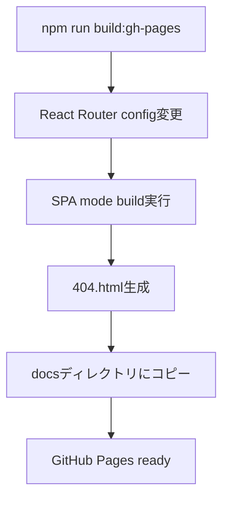

# Design Document

## Overview

vite-projectをGitHub Pagesで公開するために、React Router v7のSPAモードを活用し、GitHub Pagesの制約に対応したビルド設定とデプロイメント機能を設計します。

### 主要な技術的課題
1. **SSRからSPAへの変更**: 現在のssr: trueをssr: falseに変更
2. **GitHub Pagesのルーティング制約**: 直接URLアクセス時の404エラー対応
3. **ビルド出力の調整**: build/clientディレクトリをdocsディレクトリに配置

## Architecture

### ビルドフロー


### ディレクトリ構造
```
workspace/
├── docs/                    # GitHub Pages配信用ディレクトリ
│   ├── index.html          # メインエントリーポイント
│   ├── 404.html            # SPA routing対応
│   └── assets/             # 静的アセット
└── vite-project/
    ├── build/              # React Router build出力
    │   └── client/         # SPA build結果
    └── scripts/            # ビルドスクリプト
        └── build-gh-pages.js
```

## Components and Interfaces

### 1. React Router設定変更
- **ファイル**: `react-router.config.ts`
- **変更内容**: `ssr: false`に設定してSPAモードを有効化

### 2. GitHub Pages用ビルドスクリプト
- **ファイル**: `scripts/build-gh-pages.js`
- **機能**:
  - 既存../docsディレクトリのクリア
  - React Router buildの実行（SPA mode）
  - build/clientから../docsへのコピー
  - 404.html生成と配置

### 3. SPA Routing対応
- **404.html**: GitHub Pagesの404エラーを捕捉し、適切なルーティングを実現
- **リダイレクト機能**: URLパスをクエリパラメータに変換してindex.htmlにリダイレクト

## Data Models

### ビルド設定オブジェクト
```typescript
interface BuildConfig {
  sourceDir: string;      // 'build/client'
  targetDir: string;      // '../docs'
  baseUrl: string;        // GitHub Pages base URL
  repositoryName: string; // リポジトリ名（base path用）
}
```

### パッケージスクリプト
```json
{
  "scripts": {
    "build:gh-pages": "node scripts/build-gh-pages.js"
  }
}
```

## Error Handling

### 1. GitHub Pages 404エラー対応
- **問題**: 直接URL（例: `/quiz`）にアクセスすると404エラー
- **解決策**: 404.htmlでURLを捕捉し、クエリパラメータとしてindex.htmlにリダイレクト
- **実装**: [spa-github-pages](https://github.com/rafgraph/spa-github-pages)のソリューションを採用

### 2. ビルドエラー処理
- **ディレクトリ存在チェック**: build/clientディレクトリの存在確認
- **権限エラー**: docsディレクトリの書き込み権限確認
- **コピーエラー**: ファイルコピー失敗時のエラーハンドリング

### 3. 設定エラー対応
- **React Router設定**: ssr設定の検証
- **パッケージ依存関係**: 必要なdevDependenciesの確認

## Testing Strategy

### 1. ローカルテスト
- **静的サーバー**: docsディレクトリをローカルで配信してテスト
- **ルーティングテスト**: 各ルートへの直接アクセステスト
- **リロードテスト**: ページリロード時の動作確認

### 2. ビルドプロセステスト
- **スクリプト実行**: build:gh-pagesコマンドの動作確認
- **ファイル生成**: 必要なファイルが正しく生成されることを確認
- **アセット確認**: CSS、JS、画像ファイルの正常なコピー確認

### 3. GitHub Pages統合テスト
- **デプロイテスト**: 実際のGitHub Pagesでの動作確認
- **URL直接アクセス**: 各ルートへの直接アクセステスト
- **ブラウザ履歴**: 戻る/進むボタンの動作確認

## Implementation Notes

### React Router v7 SPA Mode
- `ssr: false`設定により、build時にindex.htmlが生成される
- `build/client`ディレクトリに静的ファイルが出力される
- HydrateFallbackコンポーネントでローディング画面を提供可能

### GitHub Pages制約
- カスタムサーバー設定不可（.htaccessやnginx.conf使用不可）
- 404.htmlを使用したクライアントサイドリダイレクトが必要
- SEO影響: 404ステータスコードが返されるため、検索エンジンに影響する可能性

### Base Path設定
- GitHub Pagesでリポジトリ名がパスに含まれる場合の対応
- Vite設定でbaseパスを適切に設定する必要