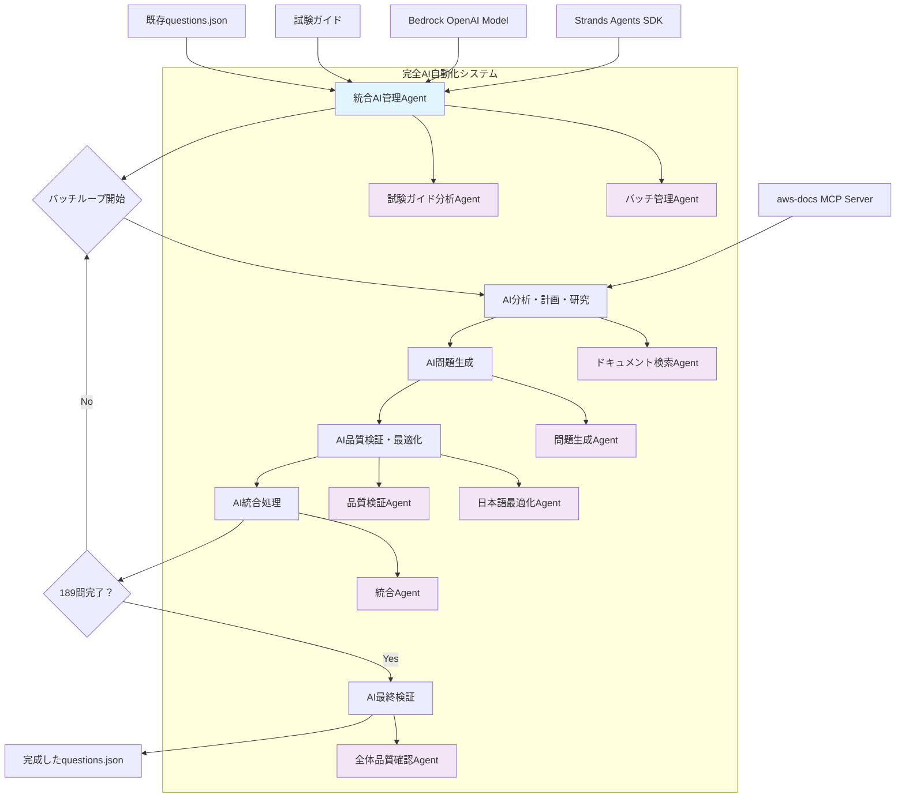

# 設計書

## 概要

この設計書では、AWS CloudOps試験対策アプリケーションの問題データベースを11問から200問に拡張するための包括的なアプローチを定義します。設計では、**Strands Agents**フレームワークと**Amazon Bedrock OpenAI**モデルを活用したAI駆動の問題生成システム、aws-docsツールを通じた権威あるAWSドキュメントの取得、および既存アプリケーションとのシームレスな統合を実現します。

## アーキテクチャ

### 高レベルアーキテクチャ



### データフロー

**完全AI駆動生成アプローチ（10問バッチ処理）**:

1. **Strands Agentsセットアップ**: 
   - Amazon Bedrock OpenAIモデル（gpt-oss-120b）の設定
   - aws-docs MCP Serverとの統合
   - 専門化されたAgentの初期化
2. **バッチ生成ループ** (189問を10問ずつ19回実行):
   - **AI分析フェーズ**: 試験ガイド分析Agentが現状と要件を自動分析
   - **AI計画フェーズ**: バッチ管理Agentが次の10問の最適計画を自動生成
   - **AI研究フェーズ**: ドキュメント検索Agentがaws-docs MCPで必要情報を自動収集
   - **AI生成フェーズ**: 問題生成Agentが10問を自動作成
   - **AI検証フェーズ**: 品質検証Agentが技術的正確性を自動確認
   - **AI最適化フェーズ**: 日本語最適化Agentが自然な表現に自動調整
   - **AI統合フェーズ**: 統合Agentが10問をquestions.jsonに自動追加
3. **AI最終検証フェーズ**: 全体品質確認Agentが200問全体を自動検証

## コンポーネントと インターフェース

### 1. Strands Agents統合コンポーネント

**責任**: AI駆動の問題生成システムの中核となるStrands Agentsの設定と管理

**主要機能**:
- Amazon Bedrock OpenAIモデル（gpt-oss-120b）の設定
- aws-docs MCP Serverとの統合
- 複数の専門化されたAgentの管理

**設定例**:
```python
from strands import Agent
from strands.models import BedrockModel
from strands.tools.mcp import MCPClient
from mcp import stdio_client, StdioServerParameters

# Bedrock OpenAIモデルの設定
bedrock_model = BedrockModel(
    model_id="openai.gpt-oss-120b-1:0",
    region_name="us-west-2",
    temperature=0.3,
    max_tokens=4000,
    top_p=0.8
)

# aws-docs MCP Serverとの統合
aws_docs_mcp_client = MCPClient(lambda: stdio_client(
    StdioServerParameters(
        command="uvx",
        args=["awslabs.aws-documentation-mcp-server@latest"]
    )
))
```

### 2. AI試験ガイド分析Agent（構造化出力）

**責任**: 試験ガイドの完全AI分析と構造化情報抽出

**Pydanticモデル定義**:
```python
from pydantic import BaseModel, Field
from typing import List, Literal

class Skill(BaseModel):
    """個別スキルの詳細情報"""
    skill_id: str = Field(description="スキルの一意識別子")
    description: str = Field(description="スキルの詳細説明")
    aws_services: List[str] = Field(description="関連するAWSサービスのリスト")
    difficulty: Literal['easy', 'medium', 'hard'] = Field(description="推定難易度レベル")

class Task(BaseModel):
    """ドメイン内のタスク情報"""
    task_id: str = Field(description="タスクの一意識別子")
    description: str = Field(description="タスクの詳細説明")
    skills: List[Skill] = Field(description="このタスクに含まれるスキルのリスト")

class DomainAnalysis(BaseModel):
    """ドメインの完全分析結果"""
    domain: str = Field(description="ドメイン名")
    weight: float = Field(description="試験における重み付け（パーセンテージ）")
    target_questions: int = Field(description="このドメインの目標問題数")
    tasks: List[Task] = Field(description="このドメインに含まれるタスクのリスト")

class ExamGuideAnalysis(BaseModel):
    """試験ガイド全体の分析結果"""
    total_questions: int = Field(description="総問題数", default=200)
    domains: List[DomainAnalysis] = Field(description="全ドメインの分析結果")
    exam_info: dict = Field(description="試験の基本情報")
```

**構造化出力を使用したAI分析**:
```python
def analyze_exam_guide_with_structured_output(guide_path: str) -> ExamGuideAnalysis:
    # 試験ガイドを読み込み
    with open(guide_path, 'r', encoding='utf-8') as f:
        guide_content = f.read()
    
    # 構造化出力を使用したAI分析
    exam_guide_analyzer_agent = Agent(
        model=bedrock_model,
        system_prompt="""
        あなたはAWS認定試験ガイドの分析専門家です。
        試験ガイドを詳細に分析し、構造化された形式で情報を抽出してください。
        """
    )
    
    analysis_prompt = f"""
    以下のAWS CloudOps試験ガイドを分析してください：
    
    {guide_content}
    
    200問の問題生成に必要な全ての情報を抽出し、
    各ドメインの重み付け、タスク、スキル、関連AWSサービスを
    構造化された形式で提供してください。
    """
    
    # 構造化出力で型安全な結果を取得
    return exam_guide_analyzer_agent.structured_output(
        ExamGuideAnalysis,
        analysis_prompt
    )
```

### 3. AWS ドキュメント取得コンポーネント（MCP統合）

**責任**: aws-docs MCP Serverを使用して関連するAWSサービスドキュメントを取得

**主要機能**:
- MCP経由でのサービス別ドキュメント検索
- ベストプラクティス情報の抽出
- 技術仕様の収集
- 設定例の取得

**MCP統合例**:
```python
# aws-docs MCPツールの使用
with aws_docs_mcp_client:
    tools = aws_docs_mcp_client.list_tools_sync()
    
    # ドキュメント検索Agent
    doc_agent = Agent(
        model=bedrock_model,
        tools=tools,
        system_prompt="""
        あなたはAWSドキュメント検索の専門家です。
        指定されたAWSサービスに関する最新の技術情報、
        ベストプラクティス、設定例を収集してください。
        """
    )
```

**インターフェース**:
```typescript
interface DocumentationRetriever {
  searchService(serviceName: string): Promise<ServiceDocumentation>;
  getBestPractices(serviceName: string): Promise<BestPractice[]>;
  getConfigurationExamples(serviceName: string): Promise<ConfigExample[]>;
}

interface ServiceDocumentation {
  serviceName: string;
  description: string;
  keyFeatures: string[];
  useCases: string[];
  limitations: string[];
  relatedServices: string[];
}
```

### 4. AI問題生成エンジン（Strands Agents）

**責任**: Strands Agentsを使用してAI駆動の試験問題生成を実行

**専門化されたAgents**:

#### 4.1 問題生成Agent（構造化出力）

**問題構造のPydanticモデル**:
```python
from pydantic import BaseModel, Field
from typing import List, Union, Literal, Optional

class LearningResource(BaseModel):
    """学習リソース情報"""
    title: str = Field(description="リソースのタイトル")
    url: str = Field(description="リソースのURL")
    type: Literal['documentation', 'whitepaper', 'tutorial', 'best-practice'] = Field(description="リソースの種類")

class Question(BaseModel):
    """AWS CloudOps試験問題の完全構造"""
    id: str = Field(description="問題ID（例：q012）")
    domain: Literal['monitoring', 'reliability', 'deployment', 'security', 'networking'] = Field(description="問題のドメイン")
    difficulty: Literal['easy', 'medium', 'hard'] = Field(description="問題の難易度")
    type: Literal['single', 'multiple'] = Field(description="問題の種類")
    question: str = Field(description="問題文（日本語）")
    options: List[str] = Field(description="選択肢のリスト（A, B, C, D...）")
    correct_answer: Union[str, List[str]] = Field(description="正解（単一選択：'A'、複数選択：['A', 'C']）")
    explanation: str = Field(description="詳細な解説（日本語）")
    learning_resources: List[LearningResource] = Field(description="学習リソースのリスト")
    related_services: List[str] = Field(description="関連するAWSサービス")
    tags: List[str] = Field(description="分類用タグ")
    task_reference: Optional[str] = Field(description="試験ガイドのタスク参照", default=None)
    skill_reference: Optional[str] = Field(description="試験ガイドのスキル参照", default=None)
    scenario: Optional[str] = Field(description="シナリオベース問題の場合のシナリオ", default=None)

class QuestionBatch(BaseModel):
    """10問のバッチ"""
    batch_number: int = Field(description="バッチ番号")
    questions: List[Question] = Field(description="10問のリスト", min_items=10, max_items=10)
    batch_metadata: dict = Field(description="バッチのメタデータ")
```

**構造化出力を使用した問題生成**:
```python
def generate_questions_with_structured_output(
    batch_plan: BatchPlan, 
    aws_docs_content: str
) -> QuestionBatch:
    
    question_generator_agent = Agent(
        model=bedrock_model,
        tools=aws_docs_tools,
        system_prompt="""
        あなたはAWS CloudOps認定試験の問題作成専門家です。
        構造化された形式で高品質な試験問題を生成してください。
        """
    )
    
    generation_prompt = f"""
    以下の情報に基づいて、AWS CloudOps試験問題を10問生成してください：
    
    バッチ計画: {batch_plan}
    AWSドキュメント: {aws_docs_content}
    
    要件：
    1. 公式AWS認定試験の形式とスタイルに従う
    2. 実世界のCloudOpsエンジニアリング状況を反映
    3. 技術的に正確で最新の情報を使用
    4. 適切な難易度レベルを設定
    5. もっともらしい誤答選択肢を作成
    6. 包括的な日本語解説を提供
    7. 関連する学習リソースを含める
    """
    
    # 構造化出力で型安全な問題生成
    return question_generator_agent.structured_output(
        QuestionBatch,
        generation_prompt
    )
```

#### 4.2 品質検証Agent（構造化出力）

**検証結果のPydanticモデル**:
```python
class QuestionValidation(BaseModel):
    """個別問題の検証結果"""
    question_id: str = Field(description="検証対象の問題ID")
    technical_accuracy: bool = Field(description="技術的正確性の検証結果")
    clarity_score: int = Field(description="問題の明確性スコア（1-10）")
    difficulty_appropriate: bool = Field(description="難易度レベルの適切性")
    distractor_quality: int = Field(description="誤答選択肢の品質スコア（1-10）")
    explanation_completeness: bool = Field(description="解説の包括性")
    resource_validity: bool = Field(description="学習リソースの有効性")
    issues: List[str] = Field(description="発見された問題点のリスト", default_factory=list)
    suggestions: List[str] = Field(description="改善提案のリスト", default_factory=list)
    overall_score: int = Field(description="総合品質スコア（1-100）")
    approved: bool = Field(description="承認可否")

class BatchValidation(BaseModel):
    """バッチ全体の検証結果"""
    batch_number: int = Field(description="バッチ番号")
    question_validations: List[QuestionValidation] = Field(description="各問題の検証結果")
    batch_quality_score: int = Field(description="バッチ全体の品質スコア（1-100）")
    domain_distribution_check: bool = Field(description="ドメイン配分の確認結果")
    difficulty_balance_check: bool = Field(description="難易度バランスの確認結果")
    duplicate_check: bool = Field(description="重複チェックの結果")
    batch_approved: bool = Field(description="バッチ承認可否")
    required_fixes: List[str] = Field(description="修正が必要な項目", default_factory=list)
```

**構造化出力を使用した品質検証**:
```python
def validate_questions_with_structured_output(
    question_batch: QuestionBatch,
    aws_docs_content: str
) -> BatchValidation:
    
    quality_validator_agent = Agent(
        model=bedrock_model,
        tools=aws_docs_tools,
        system_prompt="""
        あなたはAWS試験問題の品質検証専門家です。
        生成された問題を詳細に検証し、構造化された検証結果を提供してください。
        """
    )
    
    validation_prompt = f"""
    以下の問題バッチを詳細に検証してください：
    
    問題バッチ: {question_batch.model_dump_json(indent=2)}
    参照AWSドキュメント: {aws_docs_content}
    
    検証項目：
    1. 技術的正確性（AWSドキュメントとの整合性）
    2. 問題の明確性と曖昧さの排除
    3. 適切な難易度レベル
    4. 誤答選択肢の妥当性
    5. 包括的な説明と学習リソース
    6. ドメイン配分の確認
    7. 重複チェック
    
    各問題に対して詳細な検証結果を提供してください。
    """
    
    # 構造化出力で型安全な検証結果を取得
    return quality_validator_agent.structured_output(
        BatchValidation,
        validation_prompt
    )
```

#### 4.3 日本語最適化Agent
```python
japanese_optimizer_agent = Agent(
    model=bedrock_model,
    system_prompt="""
    あなたは日本語技術文書の専門家です。
    AWS試験問題を自然で理解しやすい日本語に最適化してください：
    
    1. 技術用語の適切な日本語表記
    2. 文法と可読性の向上
    3. 文化的コンテキストの考慮
    4. 専門用語の一貫性確保
    """
)
```

**生成戦略**:
- **シナリオベース**: 実世界のCloudOpsシナリオに基づく問題
- **技術仕様**: 特定のAWSサービス機能に関する詳細な問題
- **ベストプラクティス**: AWS Well-Architectedフレームワークに基づく問題
- **トラブルシューティング**: 一般的な問題と解決策に関する問題

**問題テンプレート**:
```typescript
interface QuestionTemplate {
  type: 'scenario' | 'technical' | 'best-practice' | 'troubleshooting';
  domain: string;
  difficulty: 'easy' | 'medium' | 'hard';
  questionType: 'single' | 'multiple';
  requiredServices: string[];
  scenario?: string;
  learningObjective: string;
}
```

### 5. AI品質検証コンポーネント

**責任**: Strands Agentsを使用した生成問題の品質と正確性の自動検証

**AI検証プロセス**:
```python
def validate_questions_with_ai(questions: List[Question]) -> ValidationResult:
    validation_results = []
    
    for question in questions:
        # 品質検証Agentによる検証
        validation_prompt = f"""
        以下の問題を検証してください：
        
        問題: {question.question}
        選択肢: {question.options}
        正解: {question.correctAnswer}
        説明: {question.explanation}
        
        検証項目：
        1. 技術的正確性
        2. 問題の明確性
        3. 難易度の適切性
        4. 誤答選択肢の妥当性
        5. 説明の包括性
        """
        
        result = quality_validator_agent(validation_prompt)
        validation_results.append(result)
    
    return ValidationResult(validation_results)
```

**検証基準**:
- 技術的正確性（AWSドキュメントとの整合性）
- 問題の明確性と曖昧さの排除
- 適切な難易度レベル
- 現実的な誤答選択肢
- 包括的な説明と学習リソース

**自動検証機能**:
1. AI駆動の構文と形式検証
2. aws-docs MCPツールを使用したAWSサービス情報の事実確認
3. 論理的一貫性の自動チェック
4. 誤答選択肢の妥当性自動確認

### 6. AI統合バッチ管理Agent（構造化出力）

**責任**: 完全AI駆動による10問単位での問題生成管理

**バッチ管理のPydanticモデル**:
```python
class DatabaseState(BaseModel):
    """現在のデータベース状態"""
    total_questions: int = Field(description="現在の総問題数")
    domain_distribution: dict[str, int] = Field(description="ドメイン別問題数")
    difficulty_distribution: dict[str, int] = Field(description="難易度別問題数")
    covered_topics: List[str] = Field(description="カバー済みトピックのリスト")
    remaining_targets: dict[str, int] = Field(description="各ドメインの残り目標数")

class BatchPlan(BaseModel):
    """次のバッチの実行計画"""
    batch_number: int = Field(description="バッチ番号")
    target_domain: str = Field(description="対象ドメイン")
    target_difficulties: List[str] = Field(description="対象難易度のリスト")
    target_topics: List[str] = Field(description="対象トピックのリスト")
    research_queries: List[str] = Field(description="AWS docs検索クエリのリスト")
    question_types: dict[str, int] = Field(description="問題タイプ別の生成数")
    priority_services: List[str] = Field(description="優先的に扱うAWSサービス")
    avoid_topics: List[str] = Field(description="重複回避すべきトピック")
    estimated_completion_time: int = Field(description="推定完了時間（分）")

class ProgressReport(BaseModel):
    """進捗レポート"""
    current_progress: float = Field(description="全体進捗率（0-100）")
    domain_progress: dict[str, float] = Field(description="ドメイン別進捗率")
    quality_metrics: dict[str, float] = Field(description="品質メトリクス")
    remaining_batches: int = Field(description="残りバッチ数")
    estimated_total_time: int = Field(description="推定総完了時間（分）")
    recommendations: List[str] = Field(description="推奨事項のリスト")
```

**構造化出力を使用したバッチ管理**:
```python
def plan_next_batch_with_structured_output(
    current_questions_json: str,
    exam_guide_analysis: ExamGuideAnalysis
) -> BatchPlan:
    
    batch_manager_agent = Agent(
        model=bedrock_model,
        system_prompt="""
        あなたはAWS試験問題生成の統合管理専門家です。
        現在の状況を分析し、最適な次のバッチ計画を構造化された形式で提供してください。
        """
    )
    
    # 現在の問題データベースを読み込み
    with open(current_questions_json, 'r', encoding='utf-8') as f:
        current_data = f.read()
    
    planning_prompt = f"""
    以下の情報に基づいて、次の10問バッチの最適な実行計画を作成してください：
    
    現在の問題データベース:
    {current_data}
    
    試験ガイド分析結果:
    {exam_guide_analysis.model_dump_json(indent=2)}
    
    考慮事項：
    1. ドメイン配分の目標達成
    2. 難易度バランスの維持
    3. トピック重複の回避
    4. 試験ガイドの要件遵守
    5. 効率的なAWSドキュメント検索
    6. 品質向上のための優先順位付け
    """
    
    # 構造化出力で型安全な計画を取得
    return batch_manager_agent.structured_output(
        BatchPlan,
        planning_prompt
    )

def generate_progress_report(
    current_questions_json: str,
    target_analysis: ExamGuideAnalysis
) -> ProgressReport:
    
    progress_agent = Agent(
        model=bedrock_model,
        system_prompt="""
        あなたは進捗管理の専門家です。
        現在の状況を分析し、詳細な進捗レポートを提供してください。
        """
    )
    
    # 構造化出力で進捗レポートを生成
    return progress_agent.structured_output(
        ProgressReport,
        f"現在の問題データベースと目標を比較し、詳細な進捗レポートを作成してください。"
    )
```

**主要機能**:
- AI駆動の現在の問題データベース状態分析
- 次のバッチで生成すべき問題の最適計画
- ドメイン配分の進捗追跡
- 重複トピックの自動回避

**インターフェース**:
```typescript
interface BatchManager {
  analyzeCurrentState(): Promise<DatabaseState>;
  planNextBatch(currentState: DatabaseState): Promise<BatchPlan>;
  validateBatchCompletion(batch: Question[]): Promise<ValidationResult>;
}

interface DatabaseState {
  totalQuestions: number;
  domainDistribution: Record<string, number>;
  difficultyDistribution: Record<string, number>;
  coveredTopics: string[];
  remainingTargets: DomainTargets;
}

interface BatchPlan {
  batchNumber: number;
  targetDomain: string;
  targetDifficulty: string[];
  targetTopics: string[];
  researchQueries: string[];
}
```

### 7. データベース統合コンポーネント（構造化出力）

**責任**: 各バッチの10問を既存のquestions.jsonファイルに統合

**統合結果のPydanticモデル**:
```python
class QuestionDatabase(BaseModel):
    """完全な問題データベース構造"""
    version: str = Field(description="データベースバージョン")
    generated_at: str = Field(description="生成日時")
    total_questions: int = Field(description="総問題数")
    domains: dict[str, int] = Field(description="ドメイン別問題数")
    difficulty: dict[str, int] = Field(description="難易度別問題数")
    question_types: dict[str, int] = Field(description="問題タイプ別問題数")
    questions: List[Question] = Field(description="全問題のリスト")

class IntegrationResult(BaseModel):
    """統合処理の結果"""
    success: bool = Field(description="統合成功可否")
    new_total_questions: int = Field(description="統合後の総問題数")
    added_questions: List[str] = Field(description="追加された問題IDのリスト")
    updated_metadata: dict = Field(description="更新されたメタデータ")
    validation_passed: bool = Field(description="統合後の検証結果")
    issues: List[str] = Field(description="発生した問題のリスト", default_factory=list)
    backup_created: bool = Field(description="バックアップ作成可否")
```

**構造化出力を使用したデータベース統合**:
```python
def integrate_questions_with_structured_output(
    current_database_path: str,
    new_question_batch: QuestionBatch,
    validation_result: BatchValidation
) -> IntegrationResult:
    
    integration_agent = Agent(
        model=bedrock_model,
        system_prompt="""
        あなたはJSON データ統合の専門家です。
        新しい問題バッチを既存のデータベースに安全に統合し、
        構造化された統合結果を提供してください。
        """
    )
    
    # 現在のデータベースを読み込み
    with open(current_database_path, 'r', encoding='utf-8') as f:
        current_data = f.read()
    
    integration_prompt = f"""
    以下の新しい問題バッチを既存のデータベースに統合してください：
    
    現在のデータベース:
    {current_data}
    
    新しい問題バッチ:
    {new_question_batch.model_dump_json(indent=2)}
    
    検証結果:
    {validation_result.model_dump_json(indent=2)}
    
    統合要件：
    1. 既存問題の完全保持
    2. ID連続性の確保（q001, q002, ...）
    3. メタデータの正確な更新
    4. JSON構造の整合性維持
    5. バックアップの作成
    6. 統合後の検証実行
    
    統合処理の詳細な結果を構造化された形式で報告してください。
    """
    
    # 構造化出力で型安全な統合結果を取得
    return integration_agent.structured_output(
        IntegrationResult,
        integration_prompt
    )

def create_final_database_with_structured_output(
    integration_results: List[IntegrationResult]
) -> QuestionDatabase:
    
    database_builder_agent = Agent(
        model=bedrock_model,
        system_prompt="""
        あなたはデータベース構築の専門家です。
        全ての統合結果から最終的なデータベース構造を構築してください。
        """
    )
    
    # 構造化出力で最終データベースを生成
    return database_builder_agent.structured_output(
        QuestionDatabase,
        f"統合結果から最終的な200問のデータベースを構築してください: {integration_results}"
    )
```

## データモデル

### 拡張された問題構造

既存の問題構造を維持しながら、以下の要素を強化：

```typescript
interface Question {
  id: string; // q001-q200
  domain: 'monitoring' | 'reliability' | 'deployment' | 'security' | 'networking';
  difficulty: 'easy' | 'medium' | 'hard';
  type: 'single' | 'multiple';
  question: string; // 日本語
  options: string[]; // A, B, C, D (または A-F for multiple choice)
  correctAnswer: string | string[]; // single: "A", multiple: ["A", "C", "D"]
  explanation: string; // 詳細な日本語説明
  learningResources: LearningResource[];
  relatedServices: string[];
  tags: string[];
  // 新しいフィールド
  taskReference?: string; // 試験ガイドのタスク参照
  skillReference?: string; // 試験ガイドのスキル参照
  scenario?: string; // シナリオベース問題の場合
}

interface LearningResource {
  title: string;
  url: string;
  type: 'documentation' | 'whitepaper' | 'tutorial' | 'best-practice';
}
```

### メタデータ構造

```typescript
interface QuestionDatabase {
  version: string;
  generatedAt: string;
  totalQuestions: number;
  domains: {
    monitoring: number; // 44問
    reliability: number; // 44問
    deployment: number; // 44問
    security: number; // 32問
    networking: number; // 36問
  };
  difficulty: {
    easy: number; // ~60問 (30%)
    medium: number; // ~100問 (50%)
    hard: number; // ~40問 (20%)
  };
  questionTypes: {
    single: number; // ~160問 (80%)
    multiple: number; // ~40問 (20%)
  };
  questions: Question[];
}
```

## エラーハンドリング

### Strands Agents エラー

- **モデル接続エラー**: Bedrock接続の自動再試行とフォールバック
- **MCP接続エラー**: aws-docs MCPサーバーとの接続復旧
- **Agent実行エラー**: エラー詳細のログ記録と代替Agent使用
- **トークン制限エラー**: プロンプト分割と段階的処理

### AWS Bedrock API エラー

- **レート制限**: 指数バックオフによる再試行
- **モデルアクセスエラー**: モデル権限の確認とエラー報告
- **リージョンエラー**: 代替リージョンへの自動切り替え

### MCP Server エラー

- **aws-docs接続エラー**: MCPサーバーの再起動と接続復旧
- **ツール実行エラー**: 代替検索クエリの自動生成
- **タイムアウトエラー**: クエリの簡素化と再実行

### AI生成品質エラー

- **不完全な問題**: 品質検証Agentによる自動検出と再生成
- **重複コンテンツ**: AI駆動の類似性チェックと除外
- **技術的不正確性**: aws-docs MCPツールとの自動クロスチェック
- **日本語品質エラー**: 日本語最適化Agentによる自動修正

### データ統合エラー

- **JSON形式エラー**: スキーマ検証による事前チェック
- **ID競合**: 自動的なID再割り当て
- **メタデータ不整合**: AI支援による自動計算と修正

## テスト戦略

### 単体テスト

- AI試験ガイド分析の精度テスト
- Strands Agents設定とモデル接続のテスト
- MCP統合機能のテスト
- AI生成データの検証ルールテスト
- JSON統合機能のテスト

### AI Agent テスト

- 問題生成Agentの出力品質テスト
- 品質検証Agentの検証精度テスト
- 日本語最適化Agentの言語品質テスト
- バッチ管理Agentの計画精度テスト

### 統合テスト

- Bedrock OpenAIモデルとの統合テスト
- aws-docs MCP Serverとの統合テスト
- エンドツーエンドのAI問題生成フロー
- 既存アプリケーションとの互換性テスト

### 品質保証テスト

- AI生成問題の技術的正確性の自動検証
- 問題の難易度レベルの妥当性確認
- 日本語の自然さと明確性の自動評価
- 学習リソースのリンク有効性確認

### パフォーマンステスト

- Strands Agents実行時間の測定
- Bedrock APIレスポンス時間の監視
- MCP Server通信のレイテンシ測定
- 大量問題生成時のメモリ使用量監視
- バッチ処理の並列実行性能テスト

## 実装考慮事項

### スケーラビリティ

- 10問バッチによる管理可能な処理単位
- Strands Agentsの並列実行サポート
- 各バッチでの進捗確認と調整機能
- 段階的なAI問題生成による品質管理
- 中断・再開可能な生成プロセス
- Bedrock APIのレート制限対応

### 保守性

- 設定可能なAI問題生成パラメータ
- Strands Agentsのシステムプロンプト管理
- 詳細なログ記録による生成プロセスの追跡
- モジュラー設計による個別Agentの更新
- MCP Server設定の外部化

### 拡張性

- 新しい問題タイプ用のAgent追加サポート
- 他のAWS認定試験への適用可能性
- 多言語サポートの将来的な追加
- 他のLLMプロバイダーへの切り替え対応
- 追加MCPツールの統合サポート

### セキュリティ

- AWS Bedrock認証情報の安全な管理
- MCP Server通信の暗号化
- 生成されたコンテンツの機密情報スキャン
- AI生成内容の適切性チェック
- 外部APIアクセスの制限と監視

### コスト最適化

- Bedrock OpenAIモデルの使用量監視
- プロンプトキャッシングの活用
- バッチ処理による効率的なAPI使用
- 不要なAPI呼び出しの削減