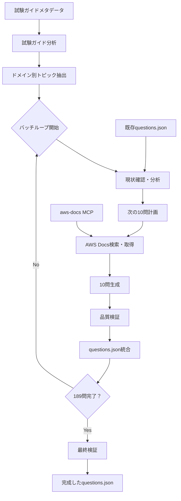

# 設計書

## 概要

この設計書では、AWS CloudOps試験対策アプリケーションの問題データベースを11問から200問に拡張するための包括的なアプローチを定義します。設計では、aws-docsツールを活用した自動化された問題生成プロセス、公式AWS試験ガイドに基づく構造化されたコンテンツ作成、および既存アプリケーションとのシームレスな統合を実現します。

## アーキテクチャ

### 高レベルアーキテクチャ



### データフロー

**段階的生成アプローチ（10問バッチ処理）**:

1. **初期分析フェーズ**: 試験ガイドから各ドメインの詳細なトピックとスキルを抽出
2. **バッチ生成ループ** (189問を10問ずつ19回実行):
   - **現状確認**: 既存問題の分析（ドメイン配分、難易度、カバー済みトピック）
   - **次バッチ計画**: 次の10問で対象とするトピック・ドメイン・難易度を決定
   - **研究フェーズ**: aws-docsツールで対象トピックの最新ドキュメントを取得
   - **生成フェーズ**: 10問を構造化されたプロンプトで作成
   - **検証フェーズ**: 生成された10問の品質・正確性・重複チェック
   - **統合フェーズ**: 10問をquestions.jsonに追加・メタデータ更新
   - **進捗確認**: 全体目標に対する進捗状況の評価
3. **最終検証フェーズ**: 200問全体の品質確認と最終調整

## コンポーネントと インターフェース

### 1. ドメイン分析コンポーネント

**責任**: 試験ガイドから構造化されたトピック情報を抽出

**入力**:
- AWS-Certified-CloudOps-Engineer-Associate_Exam-Guide.md
- ドメイン重み付け情報

**出力**:
```typescript
interface DomainTopics {
  domain: string;
  weight: number;
  targetQuestions: number;
  tasks: Task[];
}

interface Task {
  taskId: string;
  description: string;
  skills: Skill[];
}

interface Skill {
  skillId: string;
  description: string;
  awsServices: string[];
  difficulty: 'easy' | 'medium' | 'hard';
}
```

### 2. AWS ドキュメント取得コンポーネント

**責任**: aws-docsツールを使用して関連するAWSサービスドキュメントを取得

**主要機能**:
- サービス別ドキュメント検索
- ベストプラクティス情報の抽出
- 技術仕様の収集
- 設定例の取得

**インターフェース**:
```typescript
interface DocumentationRetriever {
  searchService(serviceName: string): Promise<ServiceDocumentation>;
  getBestPractices(serviceName: string): Promise<BestPractice[]>;
  getConfigurationExamples(serviceName: string): Promise<ConfigExample[]>;
}

interface ServiceDocumentation {
  serviceName: string;
  description: string;
  keyFeatures: string[];
  useCases: string[];
  limitations: string[];
  relatedServices: string[];
}
```

### 3. 問題生成エンジン

**責任**: 構造化されたプロンプトと取得したドキュメントを使用して試験問題を生成

**生成戦略**:
- **シナリオベース**: 実世界のCloudOpsシナリオに基づく問題
- **技術仕様**: 特定のAWSサービス機能に関する詳細な問題
- **ベストプラクティス**: AWS Well-Architectedフレームワークに基づく問題
- **トラブルシューティング**: 一般的な問題と解決策に関する問題

**問題テンプレート**:
```typescript
interface QuestionTemplate {
  type: 'scenario' | 'technical' | 'best-practice' | 'troubleshooting';
  domain: string;
  difficulty: 'easy' | 'medium' | 'hard';
  questionType: 'single' | 'multiple';
  requiredServices: string[];
  scenario?: string;
  learningObjective: string;
}
```

### 4. 品質検証コンポーネント

**責任**: 生成された問題の品質と正確性を確保

**検証基準**:
- 技術的正確性（AWSドキュメントとの整合性）
- 問題の明確性と曖昧さの排除
- 適切な難易度レベル
- 現実的な誤答選択肢
- 包括的な説明と学習リソース

**検証プロセス**:
1. 構文と形式の検証
2. AWSサービス情報の事実確認
3. 問題の論理的一貫性チェック
4. 誤答選択肢の妥当性確認

### 5. バッチ管理コンポーネント

**責任**: 10問単位での段階的な問題生成を管理

**主要機能**:
- 現在の問題データベース状態の分析
- 次のバッチで生成すべき問題の計画
- ドメイン配分の進捗追跡
- 重複トピックの回避

**インターフェース**:
```typescript
interface BatchManager {
  analyzeCurrentState(): Promise<DatabaseState>;
  planNextBatch(currentState: DatabaseState): Promise<BatchPlan>;
  validateBatchCompletion(batch: Question[]): Promise<ValidationResult>;
}

interface DatabaseState {
  totalQuestions: number;
  domainDistribution: Record<string, number>;
  difficultyDistribution: Record<string, number>;
  coveredTopics: string[];
  remainingTargets: DomainTargets;
}

interface BatchPlan {
  batchNumber: number;
  targetDomain: string;
  targetDifficulty: string[];
  targetTopics: string[];
  researchQueries: string[];
}
```

### 6. データベース統合コンポーネント

**責任**: 各バッチの10問を既存のquestions.jsonファイルに統合

**統合戦略**:
- 既存問題の保持
- 新しい問題のIDの連続性確保
- バッチごとのメタデータ更新
- JSON構造の整合性維持

## データモデル

### 拡張された問題構造

既存の問題構造を維持しながら、以下の要素を強化：

```typescript
interface Question {
  id: string; // q001-q200
  domain: 'monitoring' | 'reliability' | 'deployment' | 'security' | 'networking';
  difficulty: 'easy' | 'medium' | 'hard';
  type: 'single' | 'multiple';
  question: string; // 日本語
  options: string[]; // A, B, C, D (または A-F for multiple choice)
  correctAnswer: string | string[]; // single: "A", multiple: ["A", "C", "D"]
  explanation: string; // 詳細な日本語説明
  learningResources: LearningResource[];
  relatedServices: string[];
  tags: string[];
  // 新しいフィールド
  taskReference?: string; // 試験ガイドのタスク参照
  skillReference?: string; // 試験ガイドのスキル参照
  scenario?: string; // シナリオベース問題の場合
}

interface LearningResource {
  title: string;
  url: string;
  type: 'documentation' | 'whitepaper' | 'tutorial' | 'best-practice';
}
```

### メタデータ構造

```typescript
interface QuestionDatabase {
  version: string;
  generatedAt: string;
  totalQuestions: number;
  domains: {
    monitoring: number; // 44問
    reliability: number; // 44問
    deployment: number; // 44問
    security: number; // 32問
    networking: number; // 36問
  };
  difficulty: {
    easy: number; // ~60問 (30%)
    medium: number; // ~100問 (50%)
    hard: number; // ~40問 (20%)
  };
  questionTypes: {
    single: number; // ~160問 (80%)
    multiple: number; // ~40問 (20%)
  };
  questions: Question[];
}
```

## エラーハンドリング

### AWS Docs API エラー

- **レート制限**: 指数バックオフによる再試行
- **サービス利用不可**: 代替ドキュメントソースへのフォールバック
- **不正なクエリ**: クエリの自動修正と再実行

### 問題生成エラー

- **不完全な問題**: 自動的な再生成トリガー
- **重複コンテンツ**: 類似性チェックによる検出と除外
- **技術的不正確性**: AWSドキュメントとの自動クロスチェック

### データ統合エラー

- **JSON形式エラー**: スキーマ検証による事前チェック
- **ID競合**: 自動的なID再割り当て
- **メタデータ不整合**: 自動計算による修正

## テスト戦略

### 単体テスト

- ドメイン分析ロジックのテスト
- 問題生成アルゴリズムのテスト
- データ検証ルールのテスト
- JSON統合機能のテスト

### 統合テスト

- aws-docsツールとの統合テスト
- エンドツーエンドの問題生成フロー
- 既存アプリケーションとの互換性テスト

### 品質保証テスト

- 生成された問題の技術的正確性の手動レビュー
- 問題の難易度レベルの妥当性確認
- 日本語の自然さと明確性の確認
- 学習リソースのリンク有効性確認

### パフォーマンステスト

- 大量問題生成時の処理時間測定
- メモリ使用量の監視
- aws-docsツールのレスポンス時間測定

## 実装考慮事項

### スケーラビリティ

- 10問バッチによる管理可能な処理単位
- 各バッチでの進捗確認と調整機能
- 段階的な問題生成による品質管理
- 中断・再開可能な生成プロセス

### 保守性

- 設定可能な問題生成パラメータ
- ログ記録による生成プロセスの追跡
- モジュラー設計による個別コンポーネントの更新

### 拡張性

- 新しい問題タイプの追加サポート
- 他のAWS認定試験への適用可能性
- 多言語サポートの将来的な追加

### セキュリティ

- AWS認証情報の安全な管理
- 生成されたコンテンツの機密情報スキャン
- 外部APIアクセスの制限と監視